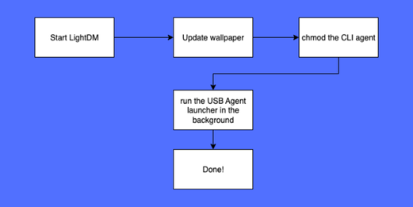
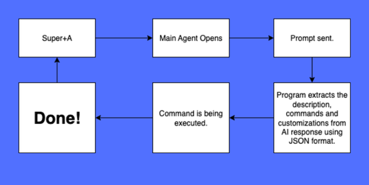

# AgenticArch

Successor to the world's first agentic Linux distribution, [AgenticCore Linux](http://agenticcore.tachion.tech "AgenticCore Linux").

## Base System

AgenticArch is based on [Arch Linux](https://archlinux.org/).

## My Contributions

This repository contains my custom scripts, configuration files, and packages used to make AgenticArch.

# Contents

- [About](#about)
- [Features](#features)
- [Installation](#installation)
- [Usage](#usage)
- [Repository Contents](#repository-contents)
- [How it works](#how-it-works)
- [Development Process](#development-process)
- [Build](#build)
- [License](#license)
- [Contact](#contact)
- [Support](#support)

# About

AgenticArch Linux is the successor to the world's first agentic Linux distribution, AgenticCore Linux. While still in alpha and experimental, it serves as a more practical and user-friendly proof of concept, better suited for personal use and daily driving than its predecessor.

It uses XFCE4 as Desktop Environment, and has multiple agents unlike AgenticCore.

# Features
## Current
- Has multiple agents, including main agent, file agent, USB agent, CLI agent.
- More user-friendly than AgenticCore.
- Supports both UEFI and Legacy boot options, unlike AgenticCore.

## Future Plans
- Enhanced Agent Programs (all will be re-written.)

- A GUI installer, installability.

- Local mode / version.

- ACE package and agent manager, which is also planned for AgenticCore.

- Voice control integration.

- Additional agent types.

- Improved hardware compatibility.

# Installation
NOTE:
## Real Device
1. Download the latest release of your desired version from [AgenticArch Website](https://agenticarch.tachion.tech/)
2. Flash it to a USB Drive using tools like [Rufus](https://rufus.ie/), [Balena Etcher](https://etcher.balena.io/) etc.
3. Boot it from BIOS menu.
4. Log in as "root" (no password) in LightDM menu.
5. Enjoy!

## Virtual Machine
1. Download the latest release of your desired version from [AgenticArch Website](https://agenticarch.tachion.tech/)
2. Create a virtual machine in your desired VM application. (OS type: Arch Linux (64 bit))
3. Boot your VM.
4. Internet:
- If you have NAT option enabled, it should already be connected to internet. You can use AgenticArch agents directly!
- If you are using bridged adapters, you can connect to wifi using WiFi program in the dock at top-right and use AgenticCore!

# Usage
Using AgenticArch is simple!
Some of the things you need to know:
- Use Super key (also known as Windows key) + A to activate the Main Agent.
Settings/Options for Main Agent:
	 	 Full Agent Mode: Executes commands right after generating them, so you dont need to press to "Execute" button every single time.
		 Confirm dangerous commands: If enabled, it will ask you to execute possibly dangerous commands, like the ones that has `sudo`, `rm` etc. in them. If disabled, it will be executed directly. If the Full Agent mode is on and this mode is off, it will execute every command right away. If the Full Agent mode is on and this mode is on, it will execute "normal" commands right away and ask for possibly dangerous commands and so on.
- Right-click into any file in file manager (Thunar) and click to "Open Agent here" option to open File Agent in that path.
- Mount an USB drive and click to "Open USB Agent" option in the "mounted" notification. That will open USB Agent for that USB drive.
- Execute this command in terminal to open CLI Agent:
	`agent`

# Repository Contents
[profiledef.sh](./profiledef.sh) -> Special profiledef file for archiso which makes build way faster.

[.automated_script.sh](./root/.automated_script.sh) -> Creates required files and rules, starts LightDM up.

[main.py](ace/agent/main.py) -> Main Agent program.

[fileagent.py](ace/agent/fileagent.py) -> File Agent program.

[usbagent.sh](ace/agent/usbagent.sh) -> USB Agent launcher.

[agent](usr/local/bin/agent) -> CLI Agent program.

[xfce4-keyboard-shortcuts.xml](root/.config/xfce4/xfconf/xfce-perchannel-xml/xfce4-keyboard-shortcuts.xml) -> XFCE4 shortcuts configuration. (there are other important configurations there as well.)

Other files / Explanations will be released soon!

# How it works
## GUI

`.automated_script.sh` creates required files, rules and launched LightDM session.

## "Main Agent" App

# Development Process
- In early 2025, i had this idea, AI-implemented operating systems. I thought there are already some prototypes of this, because it was a cool idea for me. After a quick research, i realised that there is no agentic operating system ever released. I wanted to instantly start this project, but as a 13 year-old student, this year i had a big final exam and working to that. So i didnt be able to.

- In 01.07.2025, i started to development of AgenticCore. More information is avaliable at [its repo.](http://github.com/MYusufY/agenticcore "its repo.")
- In 15.07.2025, AgenticCore was finally finished.
- In 26.07.2025, i started developing AgenticArch. I began development by the main agent app. First prototype was nearly done!
- In 27.07.2025, i finished developing main agent app and tested an ArchISO build. I used a pretty low-spec computer, so it took around a hour. It was nearly impossible to make AgenticArch like that, since it was going to take hundreds of builds for testing-debugging. So i had to fix this.
- In 28.07.2025, i edited profiledef to speed-up the building process. It now uses `zstd` compression format instead of `xz`. Building was taking less than 10 minutes now. I implemented the main agent app that day and created a basic prototype version. I installed the dependencies for agent with `--target` flag of `pip`, into `/ace/agent`. Program itself was in /ace/agent as well, (ace stands for AgenticCore Extensions, i used the same file format as AgenticCore) so it saw the libraries since Python adds the "current" directory to its PATH.
- In 29.07.2025, I had the idea about File and USB Agents. I firstly finished the first prototype of them and tested them in my ArchISO as well. File agent was easy, i just edited Thunar configuration to add Agent in options. USB Agent was not, though. I firstly tested creating system services, it was not enough to get USB device's name and automounted path etc. I tested `udev` rules as well, but it was not that efficient for "portability". So i made a bash script which checks the auto-mount path (/run/media/username/), gets information about mounted USB drives and launches File Agent with that information. I can say i built an ArchISO at least 12 times that day, 12x10=120 so **at least** 2 hours of build in a day. My computer was not happy :)
- In 30.07.2025, i simply let it change the wallpaper to AgenticArch default automatically and made some GRUB configurations. After that, i made the CLI Agent's demo.
- In 31.07.2025, i finished the CLI agent prototype as well, and implemented it into AgenticArch. It still had some things to improve, like adding a GUI WiFi manager. I did a little debugging and improvements, and Alpha release was finally done!
- In 01.08.2025, i started developing [AgenticArch website](http://agenticarch.tachion.tech "AgenticArch website").
- In 02.08.2025, i published the website and released the Alpha version!

# Build
You can follow these steps to build AgenticArch by yourself.

## Local Version
1.  Install archiso with pacman.
	`pacman -Sy archiso`

2. Create your working directory.
	`cp -r /usr/share/archiso/configs/releng/ agenticarch`
	We use releng profile for more "normal" Arch system, baseline is mostly for other use-cases.

3. Change the default profiledef with the one in this repository. (**Optional**)
	This would speed the building process up but compress less. Its up to you and your system specs.

4. Copy the contents here into same paths in your *airootfs* directory
	For example, copy the contents of root directory (in this repository) and paste it into root directory in your *airootfs*. Do the same for every directory in this repository. There may be same files there already, you should probably overwrite them. For example: .automated_script.sh already exists in *airootfs/root* directory.

	You can check [repository contents](#repository-contents "repository contents") for more details about specific files.

5. Install the requirements in specific paths.
This repository has special files for AgenticArch, but it doesnt have everything in it.
You should install agent program dependencies by yourself!
	1. Agent Dependencies
	 `pip install --target=/path/to/your/airootfs/ace/agent google-genai`

	 - If pip is not installed on your host system:
		 - `python3 -m ensurepip --default-pip`
	2. System Dependencies
		Change the current *packages-x86_64* file in your work directory with the one in this repository.

6. Connect to internet.
	- If you prefer Ethernet, directly mount and continue.
	- If you prefer WiFi:
		- If your DE (in your host Arch Linux device) has GUI WiFi manager, you can use it.
		- If it doesnt, you should use `iwctl`.
		- You can test it using `ping google.com`
	- Now, you are ready to build it!
7. Building
	If you made everything correct in this guide, you can go to your work directory and execute:
	`sudo mkarchiso -v -w work -o out .`
	to start building. It should take a while, depending on your profiledef choice (default or this version) and computer specs. It takes around 10 minutes on my low-spec computer, with my improved profiledef. With default, it takes more than a hour.

8. Done!
	 You can now build the current (Alpha) version of AgenticArch completely by yourself.

# License
AgenticArch is licensed under the Apache License 2.0.
See the [LICENSE](./LICENSE) file for details.

# Contact
You can use the [Agentux Forum (a forum for agentic Linux distributions)](http://agenticcore.tachion.tech/forum "Agentux Forum (a forum for agentic Linux distributions)") or just mail at [tachion.software@gmail.com](mailto:tachion.software@gmail.com?subject=AgenticArch "tachion.software@gmail.com") to contact with me. Thanks!

# Support
You can support me, development of AgenticCore, AgenticArch and my other projects [here.](https://buymeacoffee.com/myusuf "here.") Any donation is appreciated!
